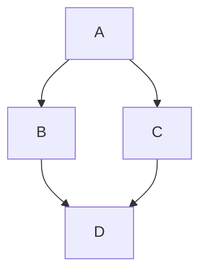

Statistika adalah ilmu yang membahas tentang pengembangan dan pembelajaran terkait metode untuk mengumpulkan, menganalisa, menginterpretasi, dan mempresentasikan data empirik. Dua ide fundamental dari statistika adalah ketidakpastian dan variasi. 

Probabilitas adalah bahasa matematika yang digunakan untuk membahas peristiwa yang tidak pasti dan memainkan peran kunci dalam statistika.

# Variabel, Populasi, dan Sampel

Variabel adalah karakteristik atau kondisi yang dapat berubah atau memiliki nilai yang berbeda-beda. Penelitian biasanya dimulai dengan pertanyaan mengenai hubungan antara dua variabel. 

Populasi adalah keseluruhan kelompok individu yang menjadi fokus penelitian. 

Sampel adalah sebagian individu yang dipilih untuk mewakili populasi dalam sebuah penelitian. Tujuan utamanya adalah menggunakan hasil dari sampel untuk menjawab pertanyaan tentang populasi.

# 