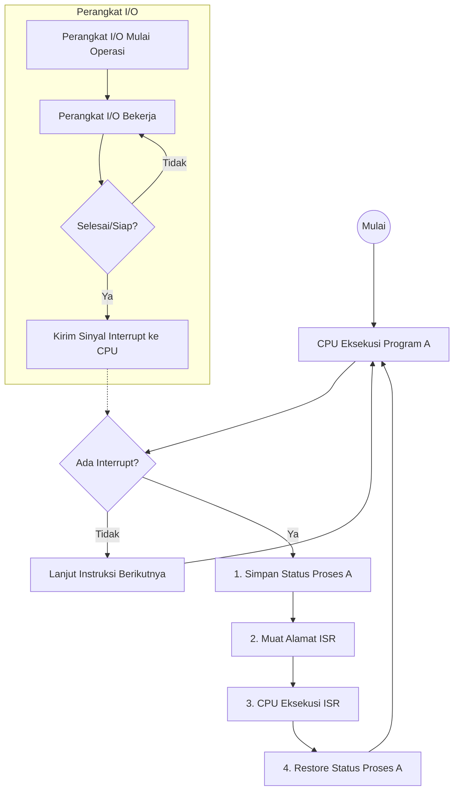

```mermaid
flowchart TD
    Start((Mulai)) --> CPU_Exec[CPU Eksekusi Program A]
    
    %% Bagian Kiri: Proses I/O
    subgraph "Perangkat I/O"
    IO_Start[Perangkat I/O Mulai Operasi] --> IO_Busy[Perangkat I/O Bekerja]
    IO_Busy --> IO_Ready{Selesai/Siap?}
    IO_Ready -- Tidak --> IO_Busy
    IO_Ready -- Ya --> Send_Int[Kirim Sinyal Interrupt ke CPU]
    end

    %% Bagian Kanan: Siklus CPU
    CPU_Exec --> Check_Int{Ada Interrupt?}
	Check_Int -- Tidak --> CPU_Next[Lanjut Instruksi Berikutnya]
    CPU_Next --> CPU_Exec
    
    Send_Int -.-> Check_Int
    
	Check_Int -- Ya --> Save_Context[1. Simpan Status Proses A]
    Save_Context --> Load_ISR[2. Muat Alamat ISR]
    Load_ISR --> Exec_ISR[3. CPU Eksekusi ISR]
    Exec_ISR --> Restore_Context[4. Restore Status Proses A]
    Restore_Context --> CPU_Exec
```
